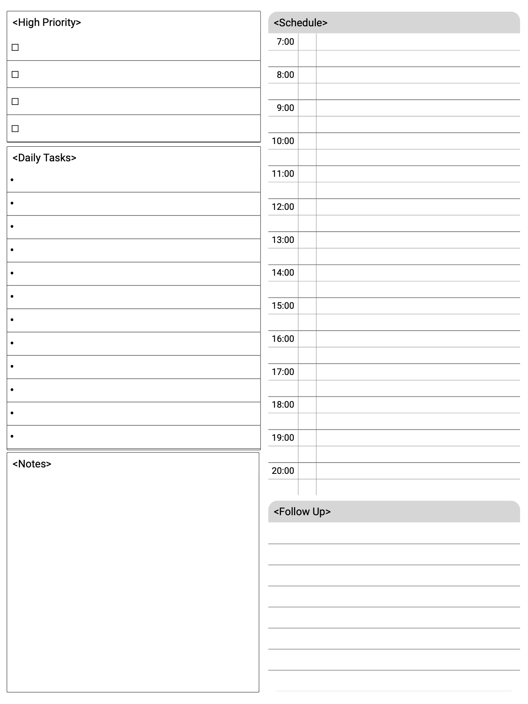
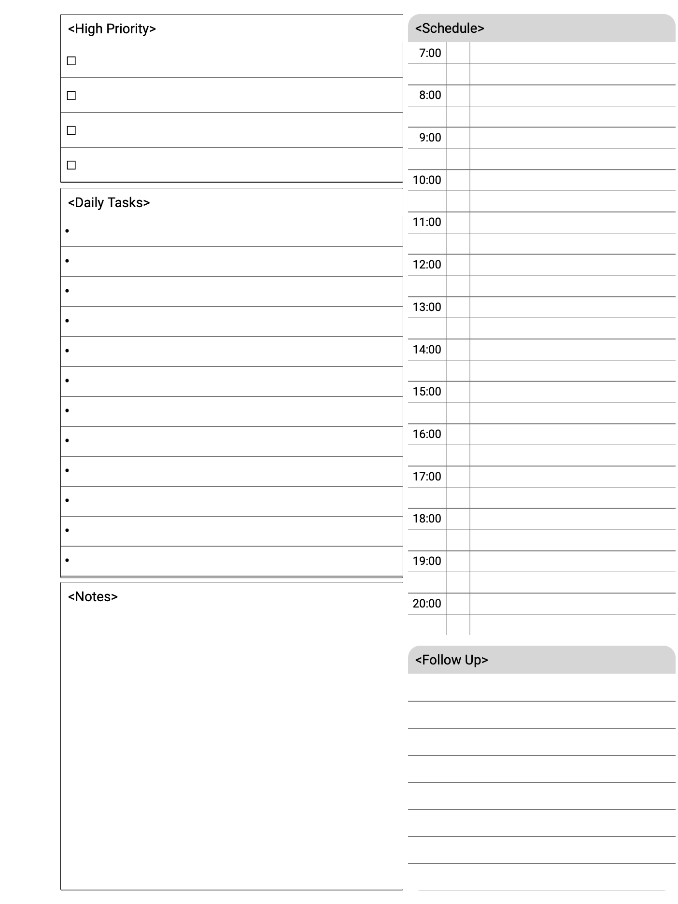

# Daily Planner Notepad Template for reMarkable 2

Introducing the Ultimate Daily Planner Template for [reMarkable 2](https://remarkable.com).

Transform your daily planning experience with a minimalist, efficient template designed specifically for the reMarkable 2 eInk notebook. Say goodbye to cumbersome yearly planners and embrace a streamlined approach that focuses on what truly matters—your day. Whether you're jotting down tasks, taking quick notes, or sketching out ideas, this template serves as a versatile digital scratch pad that adapts to your needs. Elevate your productivity and keep your planning simple, all in the sleek, distraction-free environment of your reMarkable 2.

Three variations are pre-generated for righties, lefties, and full-screen.

Browse this template and many more at [rm.ezb.io](rm.ezb.io) to enhance your reMarkable experience.

## Installation:
The provided PNG files can be easily installed on your reMarkable 2 using the reMarkable Connection Utility (RCU), making setup quick and hassle-free.

Here are sample screenshots for each template variation so you can see how they look and choose the one that fits your workflow best.

## Customization
Each template was crafted using [NoTeTo](https://github.com/dynobo/noteto), and the .json configuration files are included for those who want to dive deeper into customization and personalization.

## Screenshots
#### Full page original:

#### Right-handed:

